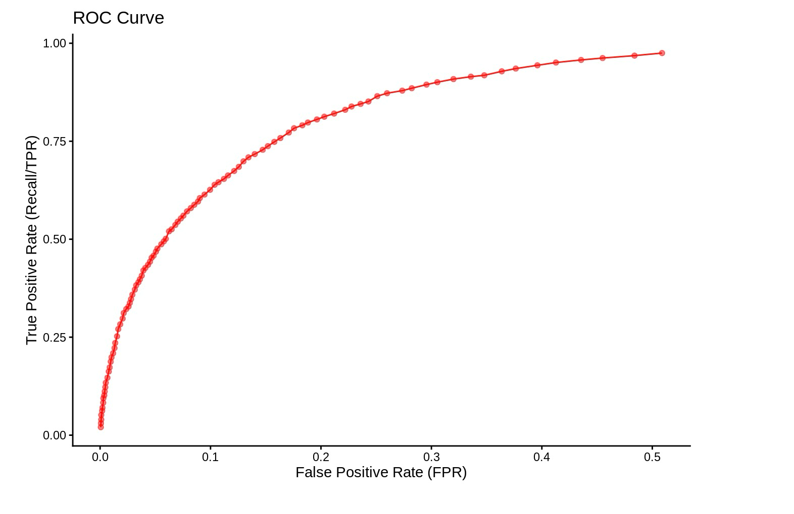
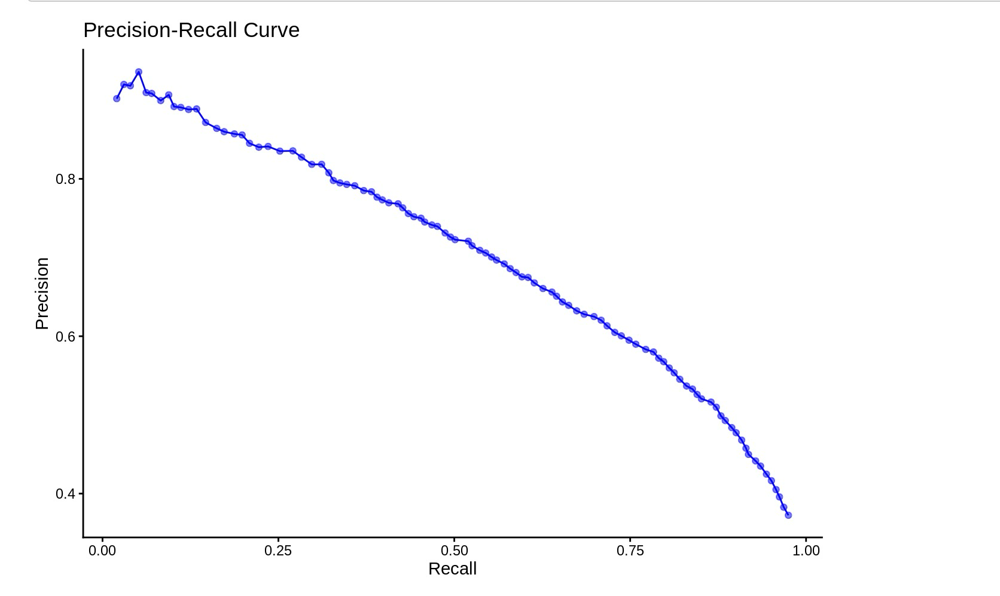

# m6APrediction: Random Forest-Based m6A Site Prediction Tools

`m6APrediction` is a small R package that provides helper functions for:

- Encoding DNA 5-mer sequences into one-hot nucleotide position factors, and  
- Predicting **m6A site probabilities and statuses** from RNA features using a **pre-trained random forest model**.

The package was developed as part of the BIO215 practicals to make it easy to reuse the trained model in downstream analyses and Shiny web applications.

---

## Installation

You can install the development version of `m6APrediction` from GitHub.

```r
# install.packages("devtools")  # if not installed
devtools::install_github("Jiang00y/m6APrediction")

# or using remotes:
# remotes::install_github("Jiang00y/m6APrediction")
```

Load the package:

```r
library(m6APrediction)
```

---

## Included model and example data

The package ships with:

- A pre-trained random forest model: `inst/extdata/rf_fit.rds`
- An example input feature data set: `inst/extdata/m6A_input_example.csv`

You can access these files at runtime via `system.file()`:

```r
model_path <- system.file("extdata", "rf_fit.rds", package = "m6APrediction")
data_path  <- system.file("extdata", "m6A_input_example.csv", package = "m6APrediction")
```

---

## Getting started

### Multiple-row prediction

`prediction_multiple()` takes a data frame of input features and returns the same data frame with two extra columns:

- `predicted_m6A_prob`  – predicted probability for the Positive class  
- `predicted_m6A_status` – `"Positive"` or `"Negative"` based on a chosen threshold

```r
library(m6APrediction)

## 1. Load the pre-trained random forest model
rf_fit <- readRDS(
  system.file("extdata", "rf_fit.rds", package = "m6APrediction")
)

## 2. Load example input feature data (100 rows)
example_data <- read.csv(
  system.file("extdata", "m6A_input_example.csv", package = "m6APrediction"),
  stringsAsFactors = FALSE
)

## 3. Predict m6A probabilities and statuses for the whole table
preds_multiple <- prediction_multiple(
  ml_fit = rf_fit,
  feature_df = example_data,
  positive_threshold = 0.5
)

head(preds_multiple)
```

### Single-row prediction

`prediction_single()` is a convenience wrapper that takes the feature values for **one** site as separate arguments and returns a named vector:

- `predicted_m6A_prob`  
- `predicted_m6A_status`

```r
pred_single <- prediction_single(
  ml_fit = rf_fit,
  gc_content = 0.5,
  RNA_type = "mRNA",
  RNA_region = "CDS",
  exon_length = 10,
  distance_to_junction = 8,
  evolutionary_conservation = 0.5,
  DNA_5mer = "GGACA",
  positive_threshold = 0.5
)

pred_single
```

---

## Model performance

The pre-trained random forest model was evaluated in an earlier practical using ROC and Precision–Recall (PR) curves.  
These plots illustrate the discriminative ability of the classifier on the m6A prediction task.

### ROC Curve



*Receiver Operating Characteristic (ROC) curve showing the trade-off between True Positive Rate (Recall / TPR) and False Positive Rate (FPR).*

### Precision–Recall Curve



*Precision–Recall (PR) curve showing how precision changes as recall increases when the decision threshold is varied.*

---

## License

This package is released under the **MIT License**.  
See the `LICENSE` file for full license text.
